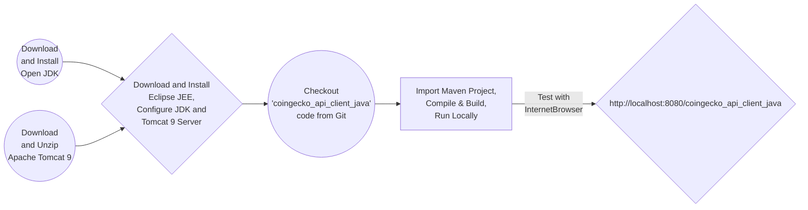

# How to Create SPA Crypto Market Watch Web Application using Java/JEE, Struts2, jQuery, CDN DataTables & CoinGecko API

### Workflow

### Getting Started

<ul>

<li>Download Open JDK 19<a href="https://jdk.java.net/java-se-ri/19" target="_new">here</a> and install</li>

<li>Download and Unzip Apache Tomcat 9 <a href="https://tomcat.apache.org/download-90.cgi" target="_new">here</a>, Add as a Server in Eclipse JEE IDE</li>

<li>Download Eclipse JEE IDE <a href="https://www.eclipse.org/downloads/packages/release/2022-12/r/eclipse-ide-enterprise-java-and-web-developers" target="_new">here</a>, configure JDK and install</li>

<li>Checkout <a href="https://github.com/lalumastan/coingecko_api_client_java.git">this code</a> from Github</li>

<li>Import the Maven application project in Eclipse</li>

<li>Compile and build the code using Eclipse by running Maven Test</li>

<li>Run the development server using Eclipse</li>

<li>Open <a href="http://localhost:8080/coingecko_api_client_java" target="_new">http://localhost:8080/coingecko_api_client_java</a> with your browser to see the result.</li>

</ul>

### References

<ul>

<li><a href="https://openjdk.org/">Open JDK</a></li>

<li><a href="https://www.eclipse.org/downloads/packages/release/2022-12/r/eclipse-ide-enterprise-java-and-web-developers">Eclipse JEE IDE</a></li>

<li><a href="https://struts.apache.org/getting-started/">Struts2 Tutorial</a></li>

<li><a href="https://struts.jgeppert.com/struts2-jquery-showcase">Struts2 jQuery Plugin  Showcase</a></li>

<li><a href="https://www.w3schools.com/html/">HTML Tutorial</a></li>

<li><a href="https://www.w3schools.com/css/">CSS Tutorial</a></li>

<li><a href="https://www.w3schools.com/js">JavaScript Tutorial</a></li>

<li><a href="https://getbootstrap.com/docs/5.3/getting-started/introduction/">Bootstrap Tutorial</a></li>

<li><a href="https://www.coingecko.com/api/documentation">CoinGecko API Documentation</a></li>

</ul>

### Tutorial

