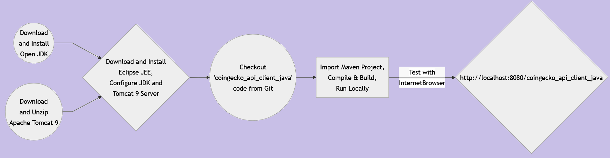
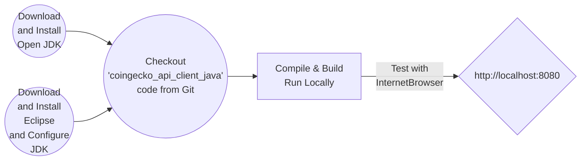

# How to Create SPA Crypto Market Watch Web Application using Java/JEE, Struts2, jQuery, CDN DataTables & CoinGecko API
### Workflow

### Getting Started
<ul>
<li>Download Open JDK <a href="https://openjdk.org/" target="_new">here</a> and install</li>
<li>Download Eclipse JEE IDE <a href="https://www.eclipse.org/downloads/packages/release/2022-12/r/eclipse-ide-enterprise-java-and-web-developers" target="_new">here</a>, configure JDK and install</li>
<li>Checkout <a href="https://github.com/lalumastan/coingecko_api_client_java.git">this code</a> from Github</li>
<li>Compile and build the code using Eclipse</li>
<li>Run the development server using Eclipse</li>
<li>Open <a  href="http://localhost:8080" target="_new">http://localhost:8080</a> with your browser to see the result.</li>
</ul>

### References
<ul>
<li><a  href="https://aiweb-icsdiscover.vercel.app/">Advanced AI Web Application Demo</a></li>
<li><a  href="https://coingecko-api-client.vercel.app">Live Demo</a></li>
<li><a  href="https://nextjs.org/learn">Interactive Next.js tutorial</a></li>
<li><a  href="https://nextjs.org/docs">Next.js Documentation</a></li>
<li><a  href="https://reactjs.org/">React</a></li>
<li><a  href="https://vercel.com">Vercel</a></li>
<li><a  href="https://www.coingecko.com/api/documentation">CoinGecko API Documentation</a></li>
</ul>

### Tutorial

