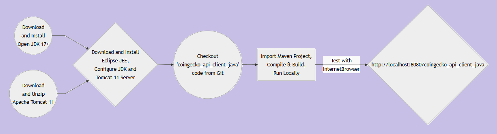
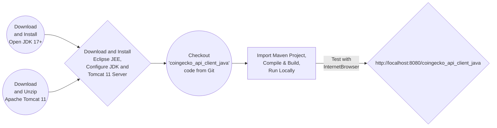

# How to Create SPA Crypto Market Watch Web Application using Java/Jakarta EE, Struts2, jQuery, CDN DataTables & CoinGecko API

### Workflow

```mermaid

graph LR

A((Download<br/>and Install<br/>Open JDK 17+)) --> C

B((Download<br/>and Unzip<br/>Apache Tomcat 11)) --> C

C{Download and Install<br/>Eclipse JEE,<br/>Configure JDK and<br/>Tomcat 11 Server} --> D

D((Checkout<br/>'coingecko_api_client_java'<br/>code from Git)) --> E

E[Import Maven Project,<br/>Compile & Build,<br/>Run Locally]

E -- Test with<br/>InternetBrowser --> H{http://localhost:8080/coingecko_api_client_java}

```

### Getting Started

<ul>

<li>Download Open JDK 17 or later <a href="https://jdk.java.net/java-se-ri/17" target="_new">here</a> and install &mdash; Struts 7.x requires Java 17+</li>

<li>Download and Unzip Apache Tomcat 11 <a href="https://tomcat.apache.org/download-11.cgi" target="_new">here</a>, Add as a Server in Eclipse JEE IDE &mdash; Tomcat 9 no longer works since Struts 7 / Jakarta EE 10 requires Servlet API 6.0+, which only Tomcat 10.1+ implements</li>

<li>Download Eclipse JEE IDE <a href="https://www.eclipse.org/downloads/packages/release/2022-12/r/eclipse-ide-enterprise-java-and-web-developers" target="_new">here</a>, configure JDK and install</li>

<li>Checkout <a href="https://github.com/lalumastan/coingecko_api_client_java.git">this code</a> from Github</li>

<li>Import the Maven application project in Eclipse</li>

<li>Compile and build the code using Eclipse by running Maven Test</li>

<li>Run the development server using Eclipse, or from the command line with <code>mvn org.eclipse.jetty.ee10:jetty-ee10-maven-plugin:run</code> (the plugin's Maven groupId changed with the move to Jetty 12's "ee10" environment, so the older <code>mvn jetty:run</code> shorthand may not resolve depending on your local Maven plugin registry &mdash; the fully-qualified goal above always works)</li>

<li>Open <a href="http://localhost:8080/coingecko_api_client_java" target="_new">http://localhost:8080/coingecko_api_client_java</a> with your browser to see the result.</li>

</ul>

### Deploy with Docker

The bundled <code>Dockerfile</code> now targets Tomcat 11 (Jakarta EE) instead of Tomcat 9 &mdash; build the WAR with <code>mvn package</code> first, then <code>docker build</code> as before.

### References

<ul>

<li><a href="https://openjdk.org/" target="_new">Open JDK</a></li>

<li><a href="https://www.eclipse.org/downloads/packages/release/2022-12/r/eclipse-ide-enterprise-java-and-web-developers" target="_new">Eclipse JEE IDE</a></li>

<li><a href="https://struts.apache.org/getting-started/" target="_new">Struts2 Tutorial</a></li>

<li><a href="https://struts.jgeppert.com/struts2-jquery-showcase" target="_new">Struts2 jQuery Plugin  Showcase</a></li>

<li><a href="https://www.w3schools.com/html/" target="_new">HTML Tutorial</a></li>

<li><a href="https://www.w3schools.com/css/" target="_new">CSS Tutorial</a></li>

<li><a href="https://www.w3schools.com/js" target="_new">JavaScript Tutorial</a></li>

<li><a href="https://getbootstrap.com/docs/5.3/getting-started/introduction/" target="_new">Bootstrap Tutorial</a></li>

<li><a  href="https://www.coingecko.com/en/api" target="_new">CoinGecko API (Use referral code CGICSDISCOVER):</a></li>

</ul>

### Tutorial

